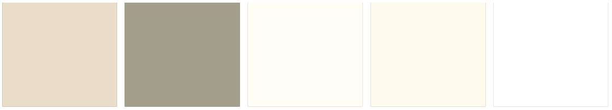

# All-About-Swords

## Project Summary

**Project Context**

`All-About-Swords App` is a Single Page Application that uses React as a front-end framework and a custom API to retrieve and display sword information. The aim of the project is to share the kind of swords that have been developed and imagined in the world. Allowing a community of sword-lovers and the curious to share and find information on swords by deploying CRUD.

**Site Owner's Goals**

As the site owner, I want others to be able to provide and retrieve info easily about the history of swords to sword enthusiasts and people looking for information on the type of swords that exists, whether in real life or fantasy.

**User Goals**

The user goals are to to share their findings and post factually correct information and fun facts on the swords that they have found.

**Live demo**

The Live Demo of the website can be accessed [here](https://helpful-babka-176ba5.netlify.app/)

## UX/UI

### **Objective**

The UI objective is to provide a Single Page Application that instils a historical look and feel and the content layout for the UX objectives was designed so that the user can immediately tell what the features are for and can easily find what they want out of the interaction in 3 clicks.

### **Strategy**

_Organisation_
* Objective: To provide a community friendly website for people to contribute and retrieve information on swords.

_User_

* Objective: To find a website that provides information on swords

* Needs: A factual and easy to read website that provides information on swords.

* Demographics:
    * Sword enthusiasts looking for a community of sword lovers
    * Casual users looking for information on certain swords

* Pain Points: Unable to find a community driven website that provides information on swords

### **User Stories**

User Stories | Acceptance Criteria(s)
------------ | -------------
As a person who is looking for a sword enthusiast community, I want to be able to contribute and find like minded people to have discussions on sword facts and history | Allow for open contribution on swords and allow for editing of information to allow the community to source check.
As a person who is looking for information on certain swords, I want to be able to search for the information in a precise and quick manner | Features that allow the user to quickly filter through information and sift through what the user is looking for.

### **Scope**

_Functional Specifications_

1. User will be able to filter from a textbox search on the sword name and is able to search by a minimum sword length to a maximum sword length, and also from a multi-select dropdown on the tags that are given to a sword.

2. User will be able to create, edit and delete a document for the sword catalogue.

_Content Requirements_

1. Information regarding swords and relevant images attached to the sword.

_Non-functional Requirements_

* Mobile Responsiveness
    * Achieved via use of bootstrap containers, grid columns and flexboxes.
* Performance

### **Structure**

- When User loads the website, they will be taken straight into the Sword catalogue page. Users can use the search filters by Name, Min Length and Max Length and Tags on the left side of the page.

- Users will see a GIF on swords as part of the hero image to instil the coolness of swords. Upon scrolling down the user can see all the info on swords as part of the catalogue and will be able to see an edit and delete button for each catalogue.

- Users can add more information on swords by clicking on the Add New Sword button at the top right corner of the screen which will take them to another page where they can fill all the info that will be shown in the sword catalogue page as a card.

- Clicking on the edit icon on the sword catalogues will take the user to another page where they can edit the existing details on the swords information.

- Clicking on the delete icon on the catalogue will take the user to another page to confirm if the user wants to delete the document and to inform that the record will be irretrievable.

## **Layer**

### Collapsible Tab
* Collapsible tabs on the navbar allows for space-saving on mobile devices.

## **Colors**
* Shades of brown were used to convey a sense of reliability and feelings of security. Conveying the sense that this website can be trusted for its information and where people can feel comfortable to share information here.
* Black and white colors were used to create contrast to the shades of brown for readable texts.

### _Color palettes used_

 

## **Typography**
* Spectral Serif was used to create a more historical feel.
* Font size is adjusted for readability
* Font weights are used appropriately for its body,sub-headers and headers.

## **Test Cases**

|Category |Input / Actions |Output / Errors |
|:------- |:------------ |:------------------- |
|Overall       |Mobile Responsive              |No error|
|Nav Bar       |Mobile Responsive              |No error|
|Nav Bar Links           |On Load / Click                |Takes me to the correct pages as intended, no error.|
|Navbar collapse|Mobile Responsive / On Click | Navbar collapsible buttons work as intended.|
|Sword Catalogue|Mobile Responsive           |No errors, upon hitting < 992px width filter options will become a row of columns to search. And cards will be displayed in a linear manner|
|Sword Catalogue |On Load                      |Gets all sword info from the database and displays it in cards. No errors.|
|Filter Options | On Click | Search functions works as intended, no error. Name will query by name, min length and max length will only query if both fields are filled and display the sword length in between the min length and max length. Tags will filter sword info that has the appropriate tags. |
| Tags Information from API | On Load | Will display all the pre-defined labels and values from the database. |
|Edit button| On Click | Will take me to the edit page and display all the existing sword info as intended.|
|Edit Confirm button       |On Click                       |Will show appropriate error messages for each input type and if it satisfies the criteria for each input, the error state variable will be reset. If all fields are valid, will PUT to the API endpoint to store the info|
|Edit cancel button  |On Click                     | Will send user back to main page and reset all error state variables and state information. |
|Add New Sword Submit button   |On Click                       |Will show appropriate error messages for each input type and if it satisfies the criteria for each input, the error state variable will be reset. If all fields are valid, will POST to the API endpoint to store the info|
|Add New Sword Cancel button |On Click |Will send user back to main page and reset all error state variables and state information|
|Footer | On Click | Will send user to my respective github and linkedIn links. |

## Technologies Used

* HTML5
    * Creating import CDN for Bootstrap and fontawesome

* CSS3
    * Styling various elements in the web app

* Javascript
    * To set conditions and interactive elements in the web app

* [ReactJS](https://reactjs.org/)
    * To create a single page application by manipulating state variables

* [Bootstrap v5.1](https://getbootstrap.com/docs/5.1/getting-started/introduction/)
    * For cards, alerts, navbar, containers and grid templates

* [Material UI](https://mui.com/)
    * For the multi-select dropdown filter

* [GitHub](https://github.com/)
    * For creation of respositories and storing source code

* [ERDPlus](https://erdplus.com/)
    * For creation of ER diagram

* [Heroku](https://devcenter.heroku.com/articles/getting-started-with-nodejs)
    * For deployment of API endpoint

* [Netlify](https://www.netlify.com/)
    * For deployment of React Application

* [Google Font](https://fonts.google.com/)
    * For selection of font family to create suitable typography

* [Multi Device Website Mockup Generator](https://techsini.com/multi-mockup/index.php)
    * To display mobile-responsiveness of web app across different devices

* [MongoDB](https://www.mongodb.com/)
    * Selected choice of database used for this project

* [Axios](https://github.com/axios/axios)
    * To call GET,POST,PUT and DELETE from the API endpoints.

## Credits

### **images**

### **Icons**

### **Fonts**